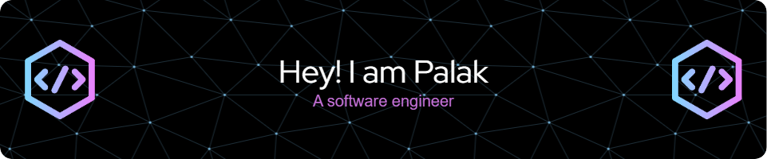

<table border="0">
  <tr>
    <td>
      <ul>
        <li> 👩‍💻 A Software Engineer specializing in JavaScript technologies and C# .NET</li>
        <li> 💻Passionate about solving problems with creative ideas</li>
        <li> 🏆Winner of the Smart India Hackathon 2023 software edition</li>
        <li> 📧 E-mail: palakhandelwalgp@gmail.com</li>
        <li> 😂 Fun fact: Internet users blink less than usual</li>
      </ul>
    </td>
  </tr>
</table>

---

### Connect with me:

 

---

### Languages and Tools:

  
  
  
  
  
  
  
  
  
  
  
  
  
  

 
 

---

  
  
  </a>

---

### Fun Section:

